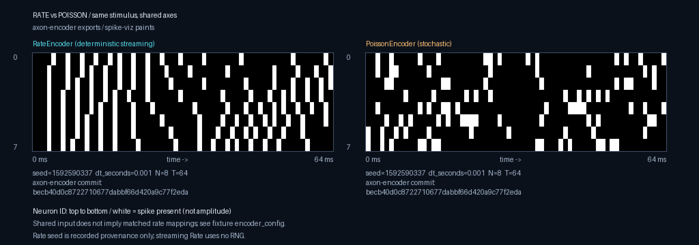

# spike-viz

[](https://github.com/rmems/spike-viz/actions/workflows/ci.yml)

PyTorch + CUDA toolkit for visualizing spiking neural network encodings and activity.

**Product split:** [axon-encoder](https://github.com/Limen-Neural/axon-encoder) owns
encoding **truth**; **spike-viz** only **paints** (load spike exports → rasters / PNG).
Bridge is export-first (`.npz` / `.npy`). See the charter for goals and non-goals.

## Install

```bash
python3 -m venv .venv
source .venv/bin/activate
pip install -e ".[dev]"
```

**CUDA is optional.** Install a CPU-only or CUDA build of PyTorch for your machine;
spike-viz must import and run loaders on CPU without a GPU. GPU paths (bloom, dense
acceleration) are additive later — never required for install.

```bash
python -c "import spike_viz; print(spike_viz.__version__)"
pytest -q
```

## Docs

| Doc | Purpose |
|-----|---------|
| [docs/CHARTER.md](docs/CHARTER.md) | Purpose, truth/paint split, non-goals |
| [docs/schema.md](docs/schema.md) | Sparse/dense spike schema |
| [docs/axon-encoder-export.md](docs/axon-encoder-export.md) | Export layout + golden fixtures |
| [AGENTS.md](AGENTS.md) | Rules for coding agents |
| [REVIEW.md](REVIEW.md) | Local quality gate before merge |

## Quick load (export case)

```python
from spike_viz import load_axon_export

case = load_axon_export("fixtures/axon-encoder/rate/tiny_synthetic")
print(case.meta["encoder"], len(case.events))
```

## Rate vs Poisson hero



The same provenance-pinned Rust stimulus, shown with shared time/neuron scales:
deterministic **streaming** Rate vs seeded stochastic Poisson. Captions include
encoder, seed, `dt_seconds`, N, T, and the full axon-encoder commit. These fixtures
use different rate mappings, so this is not a parameter-matched experiment.

See [the hero guide](docs/rate-vs-poisson-hero.md) for the rendering command,
exact axon-encoder source, and fixture regeneration instructions. No Python
re-encoding, synthetic fallback, or GPU required.
