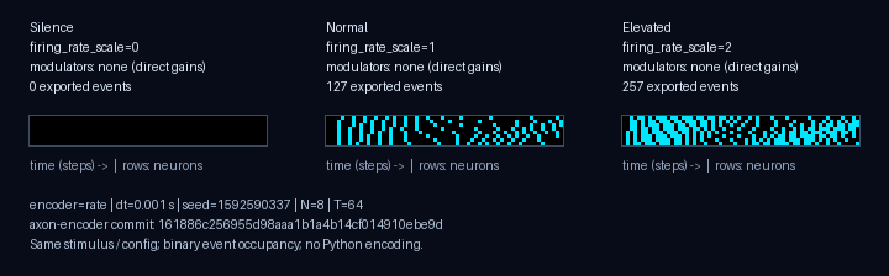

# Rate gain triptych: silence / normal / elevated



Three real axon-encoder rate exports consume **the same stimulus and encoder
configuration**, with only `EncodingGains.firing_rate_scale` changing:

| Panel | Firing-rate gain | Exported events |
|-------|------------------|-----------------|
| Silence | 0 | 0 |
| Normal | 1 (identity) | 127 |
| Elevated | 2 | 257 |

The gain is an encoder input, **not** a Python multiplier on spike counts or
pixel brightness. In the pinned upstream implementation,
[`EncodingGains` documents zero as full silence](https://github.com/Limen-Neural/axon-encoder/blob/161886c256955d98aaa1b1a4b14cf014910ebe9d/src/modulators.rs#L195-L214).
The [`RateEncoder` streaming path](https://github.com/Limen-Neural/axon-encoder/blob/161886c256955d98aaa1b1a4b14cf014910ebe9d/src/encoders/rate.rs)
accumulates phase deterministically and clears pending spikes at zero gain.
Doubling the rate need not exactly double a finite-window event count.

These cases use **direct gains**, not neurotransmitter levels or gain curves.
`meta.json` records all four `encoding_gains` scales (the other three are 1),
and `modulators: null`; the caption says `modulators: none (direct gains)`.
No neuromodulator dynamics are implemented in spike-viz.

## Render on CPU

After installing `spike-viz`, run from the repository root:

```python
from spike_viz import load_axon_export, render_gain_triptych

cases = [
    load_axon_export(f"fixtures/axon-encoder/rate/shared_sine_gain_{gain}_v1")
    for gain in (0, 1, 2)
]
render_gain_triptych(*cases, out_path="gain-triptych.png")
```

The returned Pillow image is also saved as a PNG when `out_path` is provided.
`scale=2` is the default integer nearest-neighbor enlargement; `scale=1` is
the base figure. No GPU, external fonts, bloom or live UI is needed.

All panels use identical time/neuron axes. Cyan bins represent **event
presence**, independent of amplitude or polarity; coincident events occupy
one bin. Actual exported positions are preserved, without jitter, gain
scaling, or re-encoding. Empty silence stays empty. Captions report exported
event counts, not a count of bright pixels.

Visible captions and PNG `Description` metadata include firing-rate gains,
modulator summaries, encoder, dt, seed, N, T and the full upstream commit.
The renderer rejects synthetic/unpinned cases, mismatched config/provenance
or stimuli, wrong gain order, and a nonempty zero-gain case. For other
contract-compatible rate exports, `modulators` may contain a JSON summary
object; it is displayed verbatim, not evaluated by Python.

## Reproduce the fixtures

Generation requires Git, Rust **1.99.0** (upstream's pinned toolchain), and
the repository's Python environment on PATH. Rendering the checked-in cases
does **not** require Rust.

```bash
source .venv/bin/activate
git clone https://github.com/Limen-Neural/axon-encoder.git /tmp/axon-encoder
git -C /tmp/axon-encoder checkout 161886c256955d98aaa1b1a4b14cf014910ebe9d
AXON_ENCODER_DIR=/tmp/axon-encoder scripts/generate_gain_fixtures.sh
```

The script requires that exact clean commit, archives it into a temporary
tree, and applies [`scripts/axon_gain_export.patch`](../scripts/axon_gain_export.patch)
**only to the upstream export example**. The library and original checkout
remain unchanged. The patch adds the direct-gain streaming call and metadata;
it reuses the example's stimulus, configuration, absolute-tick conversion and
NumPy staging writer. The existing `pack_axon_export.py` only assembles the
container and validates it with `load_axon_export` — it generates no spikes.

Each case records upstream version 0.6.0 and commit
[`161886c`](https://github.com/Limen-Neural/axon-encoder/commit/161886c256955d98aaa1b1a4b14cf014910ebe9d),
the export patch's SHA-256 digest, `synthetic: false`, dt=0.001 s,
seed=1592590337 (unused by deterministic rate streaming), N=8, T=64,
and the same sine/ramp stimulus and rate config (50–400 Hz, range 0–1).
The base commit **plus** the recorded patch identify the exporter; the SHA
alone is not a claim that the stock upstream example supports gain arguments.

The three directories are `fixtures/axon-encoder/rate/shared_sine_gain_{0,1,2}_v1`.
Two independent generation runs reproduced all nine files byte-for-byte.
The identity case's event arrays also match the existing `shared_sine_v1`
rate fixture. See [the export contract](axon-encoder-export.md) for the
stable on-disk layout.
